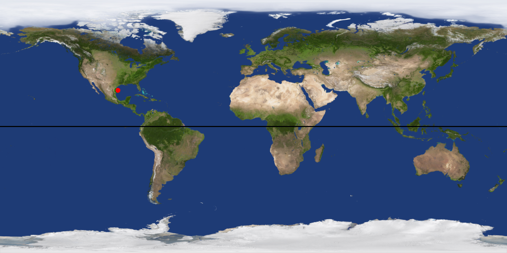

Starship telemetry
==================

Scripts for downloading, extracting and processing telemetry data from the
Starship–Superheavy integrated flight test on Apr 20 2023. Will likely update with
telemetry from subsequent launches.

I'm sharing these scripts here, but they were written to run on my Linux system and I
have not made any effort to make them portable or consider how you might run any scripts
other than `plot.py` on other systems.

The Python script `plot.py` should work on other systems as long as you install the
dependencies: `numpy`, `scipy`, `pandas`, `matplotlib`, `pillow`, and `pyatmos`.

* `download_and_crop.sh` is a bash script that calls `yt-dlp` to download SpaceX's
  YouTube video of the launch, then passes the videop stream to `ffmpeg`, whcih crops
  the regions of the image containing telemetry data and save the resulting images to
  file once per second of video.

* `extract.py` uses `pytesseract` to call `tesseract` and perform optical character
  recognition on these images, and saves the resulting data to `telemetry.csv`. This
  script just keeps running waiting for frames, you can run it at the same time as
  `download_and_crop.sh` to process data as a pipeline. You'll need to stop it manually
  with ctrl-C. This pipelining is because I was considering making some kind of
  live-updating dashboard during the next launch attempt, but this will be tricky and
  time-consuming to get right and so I probably won't end up doing that.

* `plot.py` processes the telemetry data attempts to extract vertical and downrange
  position, velocity, and acceleration. It also uses a model of atmospheric density and
  speed of sound with altitude to compute the dynamic pressure (q) and Mach number.
  Assuming that the velocity telemetry from SpaceX is in the non-inertial, rotating
  frame of the Earth, this script also uses the approximate planned bearing of the
  vehicle to compute its position above the earth over its flight, and corrects for the
  rotation speed of earth at that point to obtain its velocity in the non-rotating frame
  of the Earth. This is then used to calculate orbital parameters: apogee, perigee, and
  semimajor axis. All this data is plotted.

Obviously the vehicle didn't get very far from the launch site in its first test flight,
so this frame change and orbital parameter calculation will be more relevant for future
flights which hopefully cover more distance!

